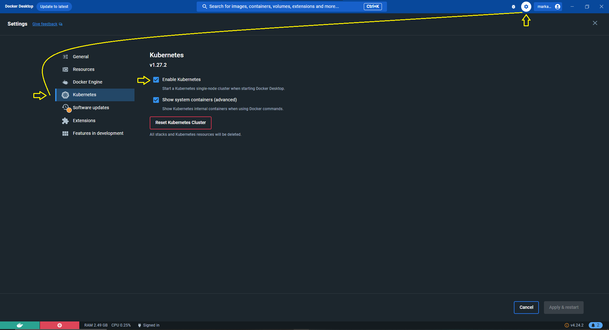

# Kubernetes Local Setup

It allows you to run Kubernetes locally on your machine. This is useful for testing Kubernetes or developing with it day-to-day.
**NOTE**: This is not meant for production clusters.

## Prerequisites

- [Docker](https://docs.docker.com/install/)
- [Docker Desktop](https://www.docker.com/products/docker-desktop)

**NOTE**: If you are using Windows, you will need to install [WSL2](https://docs.microsoft.com/en-us/windows/wsl/install-win10) and [Ubuntu](https://ubuntu.com/wsl) to run **Docker** and **Kubernetes** locally.

## Installation

Enable Kubernetes in Docker Desktop. Go to `Settings > Kubernetes > Enable Kubernetes`.



**kubectl**

Installation instructions can be found [here](https://kubernetes.io/docs/tasks/tools/install-kubectl/).

To verify the installation, run the following command:

```
kubectl version --client
```

or

```
kubectl version --client --output=yaml
```

You see an output similar to this:

```
clientVersion:
  buildDate: "2023-05-17T14:20:07Z"
  compiler: gc
  gitCommit: 7f6f68fdabc4df88cfea2dcf9a19b2b830f1e647
  gitTreeState: clean
  gitVersion: v1.27.2
  goVersion: go1.20.4
  major: "1"
  minor: "27"
  platform: windows/amd64
kustomizeVersion: v5.0.1
```

**kompose**

Installation instructions can be found [here](https://kubernetes.io/docs/tasks/configure-pod-container/translate-compose-kubernetes/#install-kompose).

**NOTE**: You may need to restart your terminal/computer after installing **kompose**.

To verify the installation, run the following command:

```
kompose version
```

You see an output similar to this:

`kompose version v1.30.0 (e4b2b9f4)`

## Running Kubernetes

### Start Kubernetes

Run the following command to start Kubernetes:

```
kubectl proxy --port=8080
```

`--port` is the port that the Kubernetes API server will listen on. You can use any port number you want.

**OPTIONAL**: Starting Kebernetes in the background:

```
kubectl proxy --port=8080 &
```

To verify that Kubernetes is running, go to `http://localhost:8080/` in your browser. You should see a JSON response.

```
{
  "paths": [
    "/.well-known/openid-configuration",
    "/api",
    "/api/v1",
    "/apis",
    "/apis/",
    "/apis/admissionregistration.k8s.io",
    "/apis/admissionregistration.k8s.io/v1",
    "/apis/apiextensions.k8s.io",
    "/apis/apiextensions.k8s.io/v1",
    "/apis/apiregistration.k8s.io",
    "/apis/apiregistration.k8s.io/v1",
    "/apis/apps",
    "/apis/apps/v1",
    ...

```

**NOTE**: If you are experiencing issues with the Kubernetes API server, you can reset the kubernetes on Docker Desktop by going to `Settings > Kubernetes > Reset Kubernetes Cluster`.

## Compose to Kubernetes

Open a new terminal and go to the project directory.

Run the following command to convert the `docker-compose.kubernetes.yml` file to Kubernetes resources:

```
kompose convert -f docker-compose.kubernetes.yml
```

This will generate the following files in the root directory. The .yaml files contain the Kubernetes resources. You may see more files depending on the services you have in your `docker-compose.kubernetes.yml` file.

- `api-tcp-service.yaml`
- `api-deployment.yaml`

## Deploy to Kubernetes Cluster

Run the following command to deploy the Kubernetes resources:

```
kubectl apply -f api-deployment.yaml
```

```
kubectl apply -f api-tcp-service.yaml
```

To verify that the Kubernetes resources are deployed, run the following command:

```
kubectl get all
```

You should see an output similar to this:

```
NAME                                READY   STATUS    RESTARTS   AGE
pod/api-deployment-7f8f9f7f9f-4q9q4   1/1     Running   0          2m

NAME                   TYPE        CLUSTER-IP      EXTERNAL-IP   PORT(S)    AGE
service/api-tcp-service   ClusterIP
```

## Managing Replicas

Run the following command to scale the number of replicas:

```
kubectl scale --replicas=3 deployment/api
```

To verify that the replicas are scaled, run the following command:

```
kubectl get all
```

You should see an output similar to this:

```
NAME                                READY   STATUS    RESTARTS   AGE
pod/api-deployment-7f8f9f7f9f-4q9q4   1/1     Running   0          2m
pod/api-deployment-7f8f9f7f9f-5q9q4   1/1     Running   0          2m
pod/api-deployment-7f8f9f7f9f-6q9q4   1/1     Running   0          2m

NAME                   TYPE        CLUSTER-IP      EXTERNAL-IP   PORT(S)    AGE
service/api-tcp-service   ClusterIP
```

You can revert the number of replicas back to 1 by running the following command:

```
kubectl scale --replicas=1 deployment/api
```

## Delete Kubernetes Resources

Run the following command to delete the Kubernetes resources:

```
kubectl delete all --all
```

When you run `kubectl get all` ,you should see an output similar to this:

```
NAME                 TYPE        CLUSTER-IP   EXTERNAL-IP   PORT(S)   AGE
service/kubernetes   ClusterIP   10.96.0.1    <none>        443/TCP   41s
```

# NOTE:

Currently my setup is generating pending pods. I am still investigating this issue. I will update this section once I have a solution.

You may also want to fix the same issue by making a pull request to this repository.
